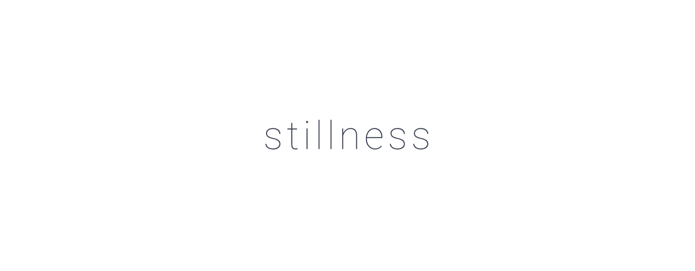

# stillness

This is a growing collection of my personal Sass helpers

## Instruction

Besides the NPM Version the will also be method to import the source folder, for direct manipulation, via a CLI command ( and even a prepared alias ), into your current directory. The `stillness/dsi` folder (Direct Source Import) is intended for this purpose.

## Links

- [Website](https://nibru.dev/stillness)
- [NPM](https://www.npmjs.com/package/stillness)
- [Repository](https://github.com/nikbrunner/stillness)

Work In Progress.
